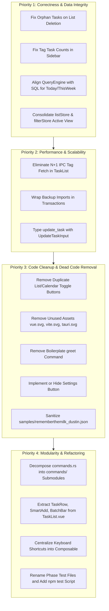

# TuDu Codebase Evaluation & Recommendations Report

**Date**: September 2026  
**Repository**: `tudu` (Tauri v2 + Vue 3 + TypeScript + libSQL / SQLite)  
**Status**: Feature-rich MVP with notable architectural debt, N+1 query bottlenecks, and synchronization bugs.

---

## 1. Executive Summary

TuDu is an impressive personal task management desktop application inspired by _Remember The Milk_ (RTM) and modern productivity tools (VS Code / Zed). It features a local-first SQLite/libSQL architecture, flexible smart lists, a responsive 3-pane layout, rich keyboard shortcut navigation, and an OpenTask v1.0 import/export interoperability layer.

However, rapid feature additions have left several architectural friction points, logic discrepancies between frontend client filtering and backend SQL queries, dead UI elements, and a critical N+1 IPC performance bottleneck.

### Summary Scorecard

| Area                             |         Rating          | Status & Key Highlight                                                                                                |
| :------------------------------- | :---------------------: | :-------------------------------------------------------------------------------------------------------------------- |
| **Correctness & Data Integrity** |   🟡 Needs Attention    | Soft-deleted lists orphan active tasks; tag counts are permanently 0; client vs backend smart list logic diverged.    |
| **Performance & Scale**          |       🟠 Warning        | Severe N+1 IPC bottleneck in `TaskList.vue` fetching task tags; non-transactional batch imports.                      |
| **Code Organization**            |  🟡 Needs Refactoring   | Massive monolithic files (`commands.rs` @ 3,700 lines, `TaskList.vue` @ 2,248 lines, `TaskDetail.vue` @ 1,486 lines). |
| **State Management**             | 🟡 Needs Simplification | Split-brain between `listStore` and `filterStore`; duplicate state across multiple stores.                            |
| **Developer Experience**         |         🟢 Good         | Fast test runner (`bun test`), 105 tests passing, oxfmt configured, though missing `"test"` npm script.               |

---

## 2. Bugs & Logic Errors

### 2.1. Soft-Deleting a List Leaves Orphaned "Ghost" Tasks

- **Location**: [`src-tauri/src/commands.rs:335-365`](file:///Users/dustinmichels/GitRepos/tudu/src-tauri/src/commands.rs#L335-L365) & [`src-tauri/src/commands.rs:376-527`](file:///Users/dustinmichels/GitRepos/tudu/src-tauri/src/commands.rs#L376-L527)
- **Description**: When a user deletes a list via `delete_list_impl`, the list row is marked `deleted_at = now`. However, tasks inside that list are **not** soft-deleted and **not** moved to Inbox. Furthermore, `get_tasks_impl` queries tasks with `WHERE t.deleted_at IS NULL` without verifying whether `t.list_id` belongs to an active list (`lists.deleted_at IS NULL`).
- **Impact**: After deleting a list, its tasks continue to appear in "All Tasks", "Today", "Tomorrow", "This Week", and search results. Clicking these tasks leads to a broken state where the list picker cannot find the list or shows a deleted ID.
- **Fix**: Either cascade soft-delete tasks when deleting a list:
  ```sql
  UPDATE tasks SET deleted_at = ?2, updated_at = ?2 WHERE list_id = ?1 AND deleted_at IS NULL;
  ```
  or reassign orphaned tasks to the default Inbox list, and add `AND t.list_id IN (SELECT id FROM lists WHERE deleted_at IS NULL)` to `get_tasks_impl`.

---

### 2.2. Tag Task Counts Permanently Zero in Sidebar

- **Location**: [`src/stores/tags.ts:69-114`](file:///Users/dustinmichels/GitRepos/tudu/src/stores/tags.ts#L69-L114) & [`src/components/Sidebar.vue:506-516`](file:///Users/dustinmichels/GitRepos/tudu/src/components/Sidebar.vue#L506-L516)
- **Description**: `tagStore.tagsWithCounts` attempts to compute incomplete task counts by scanning `taskStore.allTasks` for `"tags" in task && Array.isArray(task.tags)`. However, `get_tasks` in Rust only queries base task columns (`TASK_SELECT_COLS`). It does not join or aggregate `task_tags`. The TypeScript `Task` model also lacks a `tags` property (only `TaskDetail` has it).
- **Impact**: `"tags" in task` is always `false`. The task count for every tag in the sidebar is permanently `0`, so `<span v-if="tag.taskCount > 0">` in `Sidebar.vue` never renders.
- **Fix**: Either include a subquery / `GROUP_CONCAT(tg.name)` in `get_tasks_impl`, or create a dedicated `get_tags_with_counts` command in Rust that calculates task counts directly via SQL:
  ```sql
  SELECT tg.id, tg.name, tg.color, tg.created_at, tg.updated_at, tg.deleted_at,
         COUNT(t.id) as task_count
  FROM tags tg
  LEFT JOIN task_tags tt ON tg.id = tt.tag_id AND tt.deleted_at IS NULL
  LEFT JOIN tasks t ON tt.task_id = t.id AND t.deleted_at IS NULL AND t.completed = 0
  WHERE tg.deleted_at IS NULL
  GROUP BY tg.id;
  ```

---

### 2.3. Logic Divergence: Frontend `queryEngine.ts` vs Backend `commands.rs`

- **Location**: [`src/services/queryEngine.ts:55-97`](file:///Users/dustinmichels/GitRepos/tudu/src/services/queryEngine.ts#L55-L97) vs [`src-tauri/src/commands.rs:450-475`](file:///Users/dustinmichels/GitRepos/tudu/src-tauri/src/commands.rs#L450-L475)
- **Description**:
  1. **Today View with Completed Tasks**: Rust SQL specifies that completed tasks only show up in "Today" if their due date is _strictly today_ (`t.completed = 1 AND date(t.due) = date('now')`). But `queryEngine.ts` calls `isTodayOrOverdue(task.due)`. When "Show Completed" is toggled in the UI, every completed task from months or years ago that had a past due date is pulled into the "Today" list!
  2. **This Week View for Incomplete Tasks**: Rust SQL includes overdue tasks (`date(t.due) <= date('now', '+7 days')`). Frontend `queryEngine.ts:97` checks `d >= startOfToday && d <= endOf7Days`, strictly excluding overdue tasks.
- **Impact**: Tasks mysteriously appear or disappear depending on whether the UI reads from `taskStore.tasks` (backend-filtered) or `taskStore.filteredTasks` (client-filtered).
- **Fix**: Align `queryEngine.ts` logic with backend SQL:
  - In `matchesSmartView("today")`: if `task.completed`, match only if due date is today.
  - In `matchesSmartView("this_week")`: if `!task.completed`, allow `d <= endOf7Days`.

---

### 2.4. Split-Brain State Between `listStore` and `filterStore`

- **Location**: [`src/stores/lists.ts`](file:///Users/dustinmichels/GitRepos/tudu/src/stores/lists.ts), [`src/stores/filters.ts`](file:///Users/dustinmichels/GitRepos/tudu/src/stores/filters.ts), and [`src/stores/tasks.ts:115-143`](file:///Users/dustinmichels/GitRepos/tudu/src/stores/tasks.ts#L115-L143)
- **Description**:
  - `listStore` tracks `activeListId` and `activeView`.
  - `filterStore` tracks `selectedListId` and `smartView`.
  - Both stores track identical concepts independently. Components like `Sidebar.vue`, `App.vue`, and `CommandPaletteModal.vue` must imperatively call 5-6 reset methods across both stores to keep them in sync.
  - When `listStore.createList()` is invoked, it sets `activeListId`, but leaves `filterStore.smartView` intact. As a result, `filteredTasks` continues evaluating the old smart view (e.g. "today") and ignores the newly created list.
  - Both `taskStore` and `filterStore` also hold independent copies of `includeCompleted`.
- **Fix**: Eliminate `selectedListId` and `smartView` from `filterStore`. Treat `listStore` as the single source of truth for the active container (list or smart view). Let `filterStore` only handle secondary in-view filters: `searchQuery`, `selectedTag`, and `sortOptions`.

---

### 2.5. Timezone Bug in Date Sorting

- **Location**: [`src/utils/sorting.ts:47-65`](file:///Users/dustinmichels/GitRepos/tudu/src/utils/sorting.ts#L47-L65)
- **Description**: `sorting.ts:compareByDueDate` directly uses `new Date(aDue).getTime()`. In JavaScript engines, date-only strings like `"2026-09-12"` are parsed as UTC midnight (`2026-09-12T00:00:00.000Z`), which in US timezones converts to the prior evening (`2026-09-11 20:00:00 EDT`). However, full ISO datetime strings are parsed in local time or offset time.
- **Impact**: A date-only task due on Sept 12 sorts _before_ a task due late on Sept 11 in western timezones.
- **Fix**: Reuse `parseDueDateToLocal` from `queryEngine.ts` inside `compareByDueDate` instead of `new Date(...)`.

---

### 2.6. Inconsistent Due Date Format on Postpone

- **Location**: [`src-tauri/src/commands.rs:1260-1285`](file:///Users/dustinmichels/GitRepos/tudu/src-tauri/src/commands.rs#L1260-L1285)
- **Description**: When `postponeTask(id, days)` is called on a task that does not have an existing due date, it sets `due` to an RFC3339 timestamp with millisecond precision (`2026-09-12T17:34:28.123Z`). When called on a task with a date-only due date, it sets `due` to `YYYY-MM-DD`.
- **Fix**: Standardize on `YYYY-MM-DD` for all all-day/date-only tasks, and only produce RFC3339 if the task is explicitly timed or `is_all_day == false`.

---

### 2.7. Type Error in `tests/shortcuts.test.ts`

- **Location**: [`tests/shortcuts.test.ts:296`](file:///Users/dustinmichels/GitRepos/tudu/tests/shortcuts.test.ts#L296)
- **Description**: `listStore.setActiveView("calendar")` passes `"calendar"`, which is not a valid `DefaultView` (`"inbox" | "today" | "tomorrow" | "this_week" | "all" | "trash" | "overdue"`). In TuDu, calendar is managed via `uiStore.isCalendarView`.
- **Impact**: Type error TS2345 when running full typescript check. This was masked because `tests/` is excluded from `tsconfig.json`.

---

## 3. Performance & Scalability Bottlenecks

### 3.1. Severe N+1 IPC Overhead in `TaskList.vue` (`loadVisibleTaskTags`)

- **Location**: [`src/components/TaskList.vue:648-678`](file:///Users/dustinmichels/GitRepos/tudu/src/components/TaskList.vue#L648-L678)
- **Description**: Because `get_tasks` does not return task tags, `TaskList.vue` maintains a local `taskTagsCache` Map. Whenever visible tasks change, it iterates over missing task IDs and issues individual `getTaskDetail(id)` calls:
  ```ts
  await Promise.all(
  	missingIds.map(async (id) => {
  		const detail = await getTaskDetail(id);
  		taskTagsCache.value.set(id, detail?.tags ?? []);
  	}),
  );
  ```
  Each `getTaskDetail` call executes 3 SQLite queries (`tags`, `notes`, `subtasks`).
- **Impact**:
  - Viewing 50 tasks fires **50 asynchronous Tauri IPC round-trips** and **150 SQLite queries**.
  - Sorting by "Tags" causes layout shifts while waiting for 50 promises to resolve.
- **Fix**: Return tags alongside the task summary in `get_tasks` (e.g. JSON array or aggregated string). Eliminate `loadVisibleTaskTags` completely.

---

### 3.2. Non-Transactional Backup Import and Export

- **Location**: [`src-tauri/src/commands.rs:1948-2020`](file:///Users/dustinmichels/GitRepos/tudu/src-tauri/src/commands.rs#L1948-L2020) & [`src-tauri/src/commands.rs:2068-2578`](file:///Users/dustinmichels/GitRepos/tudu/src-tauri/src/commands.rs#L2068-L2578)
- **Description**:
  1. `export_backup_impl` performs an N+1 query loop: for every task in the database, it queries notes, reminders, and tags in 3 separate queries. For 1,000 tasks, that is 3,000 round trips.
  2. `import_backup_impl` performs thousands of individual `INSERT` / `UPDATE` queries without wrapping them in `BEGIN TRANSACTION` / `COMMIT`.
- **Impact**:
  - An import of 500 tasks takes seconds due to hundreds of SQLite disk syncs.
  - If any row fails validation, the database is left partially imported with corrupted relationships.
- **Fix**: Wrap imports in an explicit transaction:
  ```rust
  conn.execute("BEGIN TRANSACTION", ()).await?;
  // ... imports ...
  conn.execute("COMMIT", ()).await?;
  ```
  And use a single joined query with `GROUP_CONCAT` or batch fetching for exports.

---

## 4. Stale Code, Dead UI & Incomplete Features

### 4.1. Dead Settings Gear Button

- **Location**: [`src/components/GlobalHeader.vue:278-286`](file:///Users/dustinmichels/GitRepos/tudu/src/components/GlobalHeader.vue#L278-L286)
- **Description**: The header renders a `<button @click="uiStore.toggleSettings()" title="Settings">` with a `<Settings />` icon. While `uiStore.toggleSettings()` updates `isSettingsOpen`, there is **no Settings modal or dialog** anywhere in the app.
- **Fix**: Either implement the settings modal (e.g., Turso DB URL, theme preferences, backup buttons) or remove the dead button until Phase 9.

---

### 4.2. Mock / Simulated Sync

- **Location**: [`src/components/GlobalHeader.vue:90-96`](file:///Users/dustinmichels/GitRepos/tudu/src/components/GlobalHeader.vue#L90-L96)
- **Description**: The sync button triggers:
  ```ts
  function handleTriggerSync() {
  	if (uiStore.syncStatus === "offline") return;
  	uiStore.setSyncStatus("syncing");
  	setTimeout(() => {
  		uiStore.setSyncStatus("synced");
  	}, 600);
  }
  ```
  This is purely cosmetic placeholder code.

---

### 4.3. Duplicate "List | Calendar" Toggle Buttons

- **Location**: [`src/components/GlobalHeader.vue:147-165`](file:///Users/dustinmichels/GitRepos/tudu/src/components/GlobalHeader.vue#L147-L165), [`src/components/TaskList.vue:1232-1253`](file:///Users/dustinmichels/GitRepos/tudu/src/components/TaskList.vue#L1232-L1253), and [`src/components/CalendarView.vue:339-360`](file:///Users/dustinmichels/GitRepos/tudu/src/components/CalendarView.vue#L339-L360)
- **Description**: The exact same "List | Calendar" view toggle button group is rendered in two places at once: in `GlobalHeader.vue` AND in the pane header of `TaskList.vue` / `CalendarView.vue`.
- **Fix**: Keep the toggle in `GlobalHeader.vue` and remove the redundant duplicates from `TaskList.vue` and `CalendarView.vue`.

---

### 4.4. Leftover Boilerplate & Unused Assets

- **Rust `greet` command**: [`src-tauri/src/lib.rs:7-9`](file:///Users/dustinmichels/GitRepos/tudu/src-tauri/src/lib.rs#L7-L9) and line 26.
- **Template SVG assets**: `src/assets/vue.svg`, `public/vite.svg`, `public/tauri.svg`.
- **Duplicate icon**: `app-icon.svg` at root is an exact byte-for-byte duplicate of `public/logo.svg`.
- **Outdated shortcut hint**: `CommandPaletteModal.vue:155` lists shortcut as `"Enter"` for task completion, whereas the app uses `"c"`.
- **Vite template README**: `README.md` is the generic "Tauri + Vue + TypeScript" template documentation.

---

### 4.5. Real Personal Data in Repository

- **Location**: [`samples/rememberthemilk_dustin.json`](file:///Users/dustinmichels/GitRepos/tudu/samples/rememberthemilk_dustin.json)
- **Description**: Contains 700 KB of personal data including real name, personal email, account tokens, dentist/doctor appointments, financial notes, and course details.
- **Recommendation**: Remove or gitignore this file, or sanitize it using the generic `samples/rememberthemilk_sample.json`.

---

## 5. Architectural & Structural Organization

### 5.1. Breaking Down Monolithic Files

#### A. Backend: `src-tauri/src/commands.rs` (3,700 lines)

Currently combines all entities, conversions, raw SQL builders, and 1,100 lines of tests.  
**Proposed Module Hierarchy**:

```
src-tauri/src/
├── commands/
│   ├── mod.rs          # Re-exports and handler registration
│   ├── lists.rs        # list queries and mutations
│   ├── tasks.rs        # task queries, mutations, batch operations
│   ├── tags.rs         # tag creation, assignment, count queries
│   ├── notes.rs        # task notes
│   ├── reminders.rs    # reminder scheduling
│   └── backup.rs       # OpenTask export/import engine
```

#### B. Frontend: `src/components/TaskList.vue` (2,248 lines)

Currently acts as a container, search view, list view, home capture page, sort bar, batch action bar, context menu, and recursive subtask renderer.  
**Proposed Component Breakdown**:

```
src/components/
├── TaskList/
│   ├── TaskList.vue           # Lean orchestrator
│   ├── TaskListHeader.vue     # View title, count badge, sort dropdown
│   ├── TaskBatchToolbar.vue   # Multi-select action bar
│   ├── TaskContextMenu.vue    # Right-click context menu
│   ├── TaskRow.vue            # Individual task row with tags and badges
│   ├── TaskSmartAddInput.vue  # Quick add with #tag, ^due, !priority popup
│   └── HomeCaptureView.vue    # Empty-state capture dashboard
```

---

### 5.2. Untyped `serde_json::Value` in `update_task`

- **Location**: [`src-tauri/src/commands.rs:777-1130`](file:///Users/dustinmichels/GitRepos/tudu/src-tauri/src/commands.rs#L777-L1130)
- **Description**: `update_task_impl` takes `task: Value` and manually extracts 30+ fields using string lookups over 350 lines, even though `UpdateTaskInput` already exists in `models.rs`.
- **Fix**: Change `update_task` signature to accept `input: UpdateTaskInput`:
  ```rust
  #[tauri::command]
  pub async fn update_task(state: State<'_, DbState>, task: UpdateTaskInput) -> Result<Task, String>
  ```

---

### 5.3. Thin Re-export Files with Inconsistent Imports

- `src/types/index.ts` is just `export * from "../models/index.ts";`. Codebase imports from both `../models/index.ts` and `../types/index.ts`. Standardize on `src/models/` or merge into `src/types/`.
- `src/utils/index.ts` only exports `./sorting.ts`, ignoring `./smartAdd.ts` and `./icons.ts`.

---

### 5.4. Centralized Keyboard Shortcuts

Keyboard listeners are duplicated in `App.vue` and `TaskList.vue`. Create a composable `src/composables/useKeyboardShortcuts.ts` to register global hotkeys in a single place with proper modal priority and input-field exclusion.

---

## 6. Testing & Toolchain Recommendations

1. **Add Test Script to `package.json`**:
   ```json
   "scripts": {
     "test": "bun test",
     "test:typecheck": "vue-tsc --noEmit && bun run tsc --noEmit -p tsconfig.tests.json"
   }
   ```
2. **Install Type Definitions**:
   Add `@types/bun` and `@types/node` to `devDependencies` to eliminate the `// @ts-expect-error` comment in `vite.config.ts` and resolve missing `bun:test` declarations.
3. **Include Tests in TypeScript Configuration**:
   Either add `"tests/**/*.ts"` to `tsconfig.json` or create a `tsconfig.tests.json` so type regressions in test files are caught during CI.
4. **Rename Phase-Based Test Files**:
   Rename `phase3.test.ts` ... `phase8.test.ts` to semantic names:
   - `phase3.test.ts` $\rightarrow$ `queryEngine.test.ts` & `sorting.test.ts`
   - `phase4.test.ts` $\rightarrow$ `uiStore.test.ts`
   - `phase6.test.ts` $\rightarrow$ `batchActions.test.ts`
   - `phase7.test.ts` $\rightarrow$ `taskDetail.test.ts`
   - `phase8.test.ts` $\rightarrow$ `optimisticUpdates.test.ts`

---

## 7. Prioritized Implementation Roadmap


