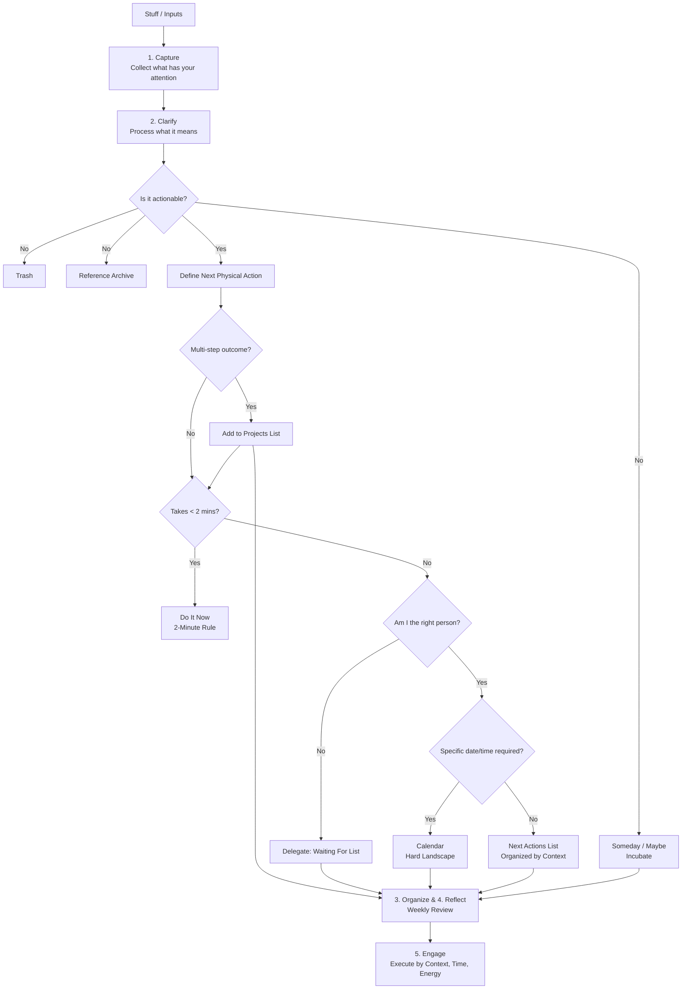
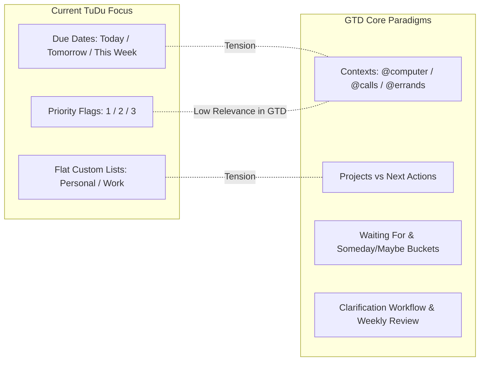

# Getting Things Done (GTD) & TuDu: Architectural Analysis & Integration Fit

---

## Executive Summary

**Getting Things Done (GTD)**, developed by David Allen, is a work-life management methodology built around a single psychological premise: _the human brain is optimized for having ideas and solving problems, not storing and tracking commitments_. When tasks and unclarified obligations remain in working memory ("open loops"), cognitive load increases, resulting in anxiety, paralysis, and procrastination.

**TuDu** is uniquely primed to be an exceptional GTD tool. Conceived with the spirit of **Remember The Milk (RTM)**—one of the original favorite tools of early GTD practitioners—TuDu already possesses the foundational building blocks: a dedicated **Inbox**, a rapid **Capture** modal (`⌘N`), a flexible **OpenTask v1.0** schema, hierarchical subtasks (`parent_id`), multiple notes for project support, and versatile tag filtering.

However, there is a fundamental philosophical tension between standard consumer task managers (which are heavily **due-date-driven**) and authentic GTD (which is strictly **context- and next-action-driven**).

This document explores:

1. The mechanics of the GTD workflow.
2. Where TuDu already excels and where structural gaps exist.
3. How to bridge those gaps using a **progressive disclosure** model that empowers GTD power users without complicating the experience for casual users.

---

## 1. Deconstructing the Getting Things Done (GTD) System

### 1.1 The 5 Stages of Mastering Workflow

GTD decomposes personal productivity into five discrete, sequential stages:



#### 1. Capture (Collect)

- **Rule**: Collect 100% of inputs ("stuff") into trusted external collection buckets (Inbox).
- **Key Criterion**: Zero friction. Do not categorize, estimate, or prioritize while capturing. Empty the head immediately.

#### 2. Clarify (Process)

- **Rule**: Process inbox items sequentially from top to bottom. Never put an item back into the Inbox.
- **The Core Question**: _"What is the next physical, visible action?"_ (e.g., instead of "Mom's birthday", write "Call florist at 555-0192 to order lilies").
- **The 2-Minute Rule**: If the next action takes less than two minutes, do it immediately during clarification rather than tracking it.

#### 3. Organize

Place the results into dedicated system buckets:

- **Projects List**: Any desired outcome requiring more than one action step (e.g., "Fix kitchen sink leak", "Publish Q3 financial report").
- **Project Support Materials**: Notes, links, drafts, and plans attached to the project.
- **Calendar ("Hard Landscape")**: Strictly for actions that _must_ happen on a specific day or at a specific time.
- **Next Actions (Context Lists)**: Actionable tasks categorized by physical or mental context (e.g., `@computer`, `@calls`, `@errands`, `@home`, `@office`).
- **Waiting For**: Actions delegated to others or pending external resolution (e.g., "Waiting for Alice to review budget draft [Sent Sept 10]").
- **Someday / Maybe**: Non-actionable aspirations or ideas to review periodically without cluttering active lists (e.g., "Learn Italian", "Backpack Patagonia").
- **Reference**: Non-actionable documents or notes retained for informational lookup.

#### 4. Reflect (Review)

- **Daily Review**: Check the calendar for the hard landscape, then choose tasks from Context lists.
- **Weekly Review** _(The critical keystone)_: Get Clear (empty inboxes), Get Current (review Next Actions, Projects, Waiting For), and Get Creative (review Someday/Maybe, brainstorm new projects). Without the Weekly Review, the system loses trust and collapses.

#### 5. Engage (Do)

Choosing what to do at any given moment using the **4-Criteria Model**:

1. **Context**: What can I do given my physical location, tools, and environment?
2. **Time available**: Do I have 10 minutes before a meeting, or a 2-hour uninterrupted block?
3. **Energy available**: Am I mentally fresh (deep work) or drained (low-energy tasks like filing expenses)?
4. **Priority**: Given the above three filters, which action provides the highest value?

---

### 1.2 The "Hard Landscape" vs. Due Date Debt

One of David Allen's most emphatic principles is: **Never put a task on the calendar or give it a due date unless it truly must be done on or by that specific date.**

When people assign artificial due dates to everyday tasks ("I should clean the garage by Thursday"), they incur **rescheduling debt**. When Thursday arrives and life intervenes, the task turns red, triggers psychological guilt, and must be manually postponed by 1 day or 1 week. Eventually, the user learns that due dates in the app don't mean anything real, and the entire system loses trust.

In GTD:

- **Calendar / Due Dates**: Hard deadlines (tax filings, flight departures, doctor appointments).
- **Next Actions**: Everything else, executed as soon as possible filtered by context and energy.

---

## 2. Current State of TuDu

TuDu's design and underlying data layer already align remarkably well with many aspects of GTD:

| Dimension              | TuDu Current Implementation                                                                                                                                                                                                                                                                                                                                                                                                                                                  | GTD Compatibility                                                               |
| :--------------------- | :--------------------------------------------------------------------------------------------------------------------------------------------------------------------------------------------------------------------------------------------------------------------------------------------------------------------------------------------------------------------------------------------------------------------------------------------------------------------------- | :------------------------------------------------------------------------------ |
| **Tech Stack**         | Tauri v2 (Rust + SQLite/libSQL), Vue 3, Pinia, Tailwind CSS                                                                                                                                                                                                                                                                                                                                                                                                                  | High speed, local-first, zero latency $\rightarrow$ Ideal for low-friction GTD. |
| **Data Schema**        | [OpenTask v1.0](file:///Users/dustinmichels/GitRepos/tudu/standard.md) ([`Task`](file:///Users/dustinmichels/GitRepos/tudu/src/models/index.ts#L30), [`List`](file:///Users/dustinmichels/GitRepos/tudu/src/models/index.ts#L18), [`Tag`](file:///Users/dustinmichels/GitRepos/tudu/src/models/index.ts#L67), [`Note`](file:///Users/dustinmichels/GitRepos/tudu/src/models/index.ts#L76), [`Reminder`](file:///Users/dustinmichels/GitRepos/tudu/src/models/index.ts#L188)) | Highly compatible. Contains `status`, `notes[]`, `parent_id`, and `extra`.      |
| **Default Inbox**      | Dedicated system Inbox list (Migration 0003: `00000000-0000-0000-0000-000000000001`)                                                                                                                                                                                                                                                                                                                                                                                         | **Matches GTD Stage 1 (Capture)** directly.                                     |
| **Quick Capture**      | `⌘N` modal ([`CaptureModal.vue`](file:///Users/dustinmichels/GitRepos/tudu/src/components/CaptureModal.vue)) + syntax parsing (`#tag`, `^due`, `!priority`)                                                                                                                                                                                                                                                                                                                  | Rapid capture with minimal mental disruption.                                   |
| **Hierarchical Tasks** | Subtasks via `parent_id` with subtask completion tracking                                                                                                                                                                                                                                                                                                                                                                                                                    | Natural container for multi-step **Projects**.                                  |
| **Project Support**    | Multiple independent [`Note`](file:///Users/dustinmichels/GitRepos/tudu/src/models/index.ts#L76) objects per task with Markdown editor                                                                                                                                                                                                                                                                                                                                       | Matches GTD's project support materials.                                        |
| **Smart Views**        | Inbox, Today, Tomorrow, This Week, Overdue, Calendar, Trash                                                                                                                                                                                                                                                                                                                                                                                                                  | Currently date-centric; easily extendable to context and status views.          |

---

## 3. Gap Analysis: Where TuDu and GTD Diverge



### 3.1 Due Date Overuse vs. Contextual Next Actions

- **In TuDu today**: The primary ways to view tasks are by List or by Due Date (`Today`, `Tomorrow`, `This Week`, `Overdue`). If a task has no due date, it only lives in its parent list.
- **In GTD**: Most tasks should **not** have due dates. They belong on a **Next Actions** list filtered by **Context** (e.g., "When I'm at my computer with 30 minutes, what can I do?"). TuDu currently lacks a unified "Next Actions" view that surfaces undated, actionable tasks across all lists.

### 3.2 Projects vs. Subtasks (The Next Action Visibility Problem)

- **In TuDu today**: When a task has subtasks (`parent_id !== null`), the center pane explicitly filters subtasks out:
  ```typescript
  // TaskList.vue line 238
  const rootTasks = tasks.filter((t) => !t.parent_id);
  ```
  Subtasks are only visible when the user selects the parent task and views the right-hand [`TaskDetail.vue`](file:///Users/dustinmichels/GitRepos/tudu/src/components/TaskDetail.vue) panel.
- **In GTD**: A Project is not an action; you cannot "do" a project. You can only do its **Next Action**. If the next action is buried inside a subtask list, it is invisible in daily execution views. GTD requires that every active project automatically surfaces its current Next Action to the context lists.

### 3.3 Tags vs. Actionable Contexts

- **In TuDu today**: Tags are general labels (`#finance`, `#website`, `#starter`).
- **In GTD**: Contexts define **physical constraints** (`@phone`, `@desk`, `@errands`, `@home`, `@boss`). While users can manually name tags with an `@` prefix (e.g., `#@calls`), TuDu's smart add parser currently parses `@` as an invalid tag character or doesn't treat contexts as first-class filters alongside lists.

### 3.4 Missing First-Class Buckets: "Waiting For" and "Someday/Maybe"

- **Waiting For**: When delegating work or waiting on a delivery, GTD tracks: _Who owes this, what was requested, and when was it asked?_ In TuDu, this currently requires making a manual list or custom tag without dedicated follow-up metadata.
- **Someday/Maybe**: Aspirations that shouldn't clutter active lists. While users can create a "Someday" list, TuDu doesn't provide dedicated review cycles or separation from active project counts.

### 3.5 Lack of a Guided "Clarify" (Processing) Mode

- **In TuDu today**: Captured tasks sit in the Inbox. The user views them in a regular task list and can manually edit them or drag them.
- **In GTD**: Processing the inbox is a focused, rapid triage ritual answering: _Is it actionable? Does it take < 2 minutes? Is it a project? What's the context?_

---

## 4. Strategic Integration Approaches for TuDu

How should TuDu incorporate GTD?

| Approach                                      | Architecture & Effort                                                                                                                                                                                 | User Experience                                                                                                   | Verdict                |
| :-------------------------------------------- | :---------------------------------------------------------------------------------------------------------------------------------------------------------------------------------------------------- | :---------------------------------------------------------------------------------------------------------------- | :--------------------- |
| **Approach 1: Dogmatic GTD Rewrite**          | High effort. Redesign database around Projects, Contexts, Horizons. Remove generic lists.                                                                                                             | Forces strict GTD on everyone. Alienates users who just want a clean Remember The Milk or Todoist replacement.    | ❌ **Too restrictive** |
| **Approach 2: Pure GTD by Convention**        | Zero code changes. Write a guide on how users can create `@context` tags and a "Waiting For" list themselves.                                                                                         | Leaves all cognitive burden on the user. No special UI, no Next Action bubbling, no clarify mode.                 | ⚠️ **Under-powered**   |
| **Approach 3: Progressive GTD (Recommended)** | Moderate, iterative effort. Keep TuDu's clean, familiar list interface, but introduce native GTD powers via Smart Views, token syntax (`@context`), Next Action logic, and optional Review workflows. | **Best of both worlds.** Casual users get a super-fast todo app; GTD practitioners get a world-class GTD cockpit. | ✅ **Recommended**     |

---

## 5. Concrete Implementation Blueprint: "Progressive GTD" for TuDu

Here is how GTD can fit organically into TuDu across four phased horizons:

```mermaid
timeline
    title TuDu GTD Roadmap
    section Phase 1 : Contexts & Smart Views
        @context syntax parser : Smart Views for Next Actions, Waiting For, Someday
    section Phase 2 : Project Engine
        Sequential vs Parallel subtasks : Auto-surface active Next Action
    section Phase 3 : Clarify Mode
        Inbox Triage assistant : 2-minute timer & quick delegate
    section Phase 4 : The Weekly Review
        Interactive review wizard : Project audit & Someday/Maybe sweep
```

---

### Horizon 1: First-Class Contexts & GTD Smart Views (Low Effort, High Impact)

#### 1. `@context` Smart Add Syntax

Extend [`smartAdd.ts`](file:///Users/dustinmichels/GitRepos/tudu/src/utils/smartAdd.ts) to recognize `@` as a context token alongside `#` (tags/lists), `^` (due dates), and `!` (priority):

- Example: `"Call electrician to get quote @calls ^tomorrow !1"`
- In the database: Contexts can be stored in the existing `tags` table (prefixed with `@` or with a `type: 'context'` flag in OpenTask `extra`).

#### 2. GTD Core Smart Views in the Sidebar

Expand [`queryEngine.ts`](file:///Users/dustinmichels/GitRepos/tudu/src/services/queryEngine.ts) and [`Sidebar.vue`](file:///Users/dustinmichels/GitRepos/tudu/src/components/Sidebar.vue) with an optional **GTD Section**:

- **Next Actions (`⚡ Next`)**: All uncompleted, actionable tasks that are **not** waiting, not someday/maybe, and either have no due date or are due $\le$ today. Groupable by Context (`@calls`, `@computer`, `@errands`).
- **Waiting For (`⏳ Waiting`)**: Tasks tagged `@waiting` or marked with a delegated status, showing days elapsed since assignment.
- **Someday / Maybe (`💡 Someday`)**: Tasks in a designated "Someday" list or tagged `#someday`, excluded from standard task counts.
- **Agenda / People (`👤 Agendas`)**: Filter tasks by person (e.g., `@agenda:sarah`).

---

### Horizon 2: The Project Engine & Next Action Auto-Surfacing

In GTD, any task with subtasks is a **Project**. Currently, subtasks in TuDu are hidden from top-level views.

#### Subtask Execution Modes:

Add an execution mode to parent tasks (stored in `tasks.extra` or as a column):

1. **Sequential (Default in GTD)**: Only the **first** incomplete subtask is the active "Next Action".
   - When Subtask 1 is checked off, Subtask 2 automatically bubbles up into the user's `@context` and `Next Actions` views.
2. **Parallel**: All incomplete subtasks are simultaneously actionable and visible in their respective context views.

#### UI Representation:

- In `TaskList.vue`, display an indicator next to projects: `[ 1/4 actions completed ]`.
- In `Next Actions` view, display:
  `Call city permit office` · _from project: Kitchen Remodel_

---

### Horizon 3: The "Process Inbox" (Clarify) Workflow

Add a **"Process Inbox"** button at the top of the Inbox view. Clicking it opens a focused, distraction-free modal that walks through each inbox item one by one:

```
+-------------------------------------------------------------+
| Clarify Inbox Item (3 of 12 remaining)                      |
|                                                             |
| "Dentist checkup"                                           |
|                                                             |
| Is it actionable?                                           |
| [ Trash (⌫) ]   [ Someday/Maybe (S) ]   [ Reference (R) ]   |
|                                                             |
| What is the Next Action?                                    |
| [ Call Dr. Smith's office to schedule cleaning            ] |
|                                                             |
| Does it take < 2 minutes?                                   |
| [ ⏱️ Do It Now! ]                                           |
|                                                             |
| Context: [@phone ▼]   Project: [Health & Wellness ▼]        |
| Due (Hard deadline only): [None ▼]                          |
|                                                             |
| [ Delegate (Waiting For) ]            [ Save Next Action ↵ ]|
+-------------------------------------------------------------+
```

This transforms TuDu from a passive bucket into an active workflow coach.

---

### Horizon 4: The Weekly Review Assistant

The Weekly Review is why GTD practitioners stay loyal to specialized tools like OmniFocus. TuDu can implement a lightweight, 4-step guided review ritual accessible via the Command Palette (`⌘K → Start Weekly Review`) or Sidebar:

1. **Get Clear**: Process Inbox to zero; check for loose notes.
2. **Get Current**:
   - Review **Calendar**: Check past week for follow-ups; inspect upcoming 2 weeks for prep.
   - Review **Waiting For**: Follow up on stalled items or mark received.
   - Review **Projects**: Ensure **every single active project has at least one active Next Action**. Flag "stalled projects" (projects with 0 next actions).
3. **Get Creative**: Review **Someday / Maybe** list; promote any projects whose time has come.
4. **Wrap-up Celebration**: Sound/animation affirming that the system is 100% trusted and current.

---

## 6. Summary Comparison: Standard TuDu vs. GTD-Enhanced TuDu

| Feature                     | Standard TuDu                          | GTD-Enhanced TuDu                                   |
| :-------------------------- | :------------------------------------- | :-------------------------------------------------- |
| **Primary Organizing Axis** | Lists (`Personal`, `Work`) & Due Dates | Contexts (`@desk`, `@calls`) & Projects             |
| **Inbox Role**              | Default list for unassigned items      | Temporary holding pen, clarified to zero            |
| **Handling Undated Tasks**  | Stays in custom list; easily forgotten | Surfaces into active `Next Actions` contextual view |
| **Subtasks**                | Hidden inside detail drawer            | Sequential auto-bubbling into context lists         |
| **Delegation**              | Notes or custom text                   | Dedicated `Waiting For` tracking                    |
| **Weekly Review**           | Manual scrolling                       | Guided 4-step audit wizard                          |

---

## 7. Next Steps & Recommended Decisions

To proceed with bringing GTD capabilities into TuDu:

1. **Decide on Context Syntax**: Should `@` be a first-class shortcut in the Quick Add parser (`@context`) alongside `#tag`?
2. **Smart Views Priority**: Should we add `Next Actions`, `Waiting For`, and `Someday/Maybe` to the smart list section of [`Sidebar.vue`](file:///Users/dustinmichels/GitRepos/tudu/src/components/Sidebar.vue)?
3. **Subtask Surfacing**: Should sequential subtasks automatically surface to the Next Actions view?
